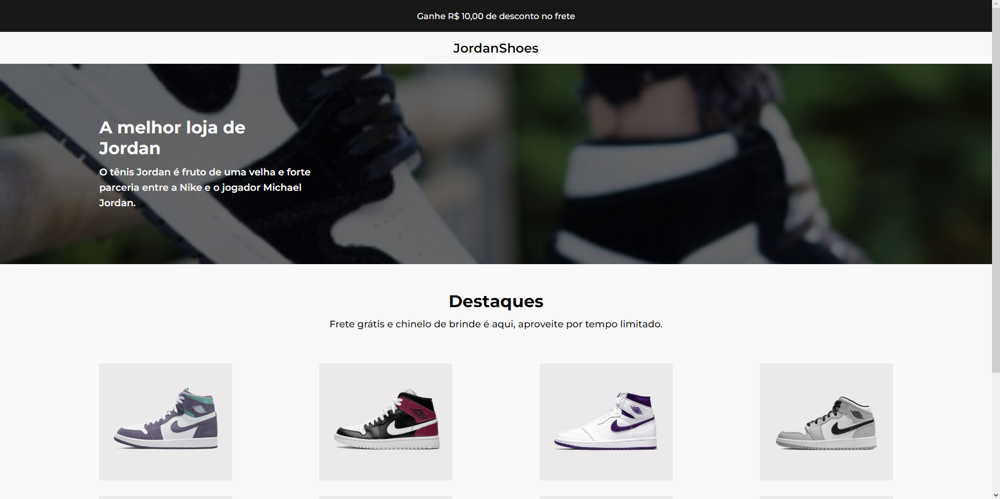

<h1 align="center"> Projeto de site para loja de tênis</h1>

Desafio exclusivo e gratuito, promovido pela comunidade do professor Iuri Code.

  <a href="#-tecnologias">Tecnologias</a>&nbsp;&nbsp;&nbsp;|&nbsp;&nbsp;&nbsp;
  <a href="#-projeto">Projeto</a>&nbsp;&nbsp;&nbsp;|&nbsp;&nbsp;&nbsp;
  <a href="#-layout">Layout</a>&nbsp;&nbsp;&nbsp;|&nbsp;&nbsp;&nbsp;
  <a href="#memo-licença">Licença</a>

  

 

  

## 🚀 Tecnologias

Esse projeto foi desenvolvido com as seguintes tecnologias:

- HTML e CSS
- JavaScript
- Git e Github

## 💻 Projeto

Desafio que tinha como meta a construção de um site de vendas de tênis para treinar o conhecimento em CSS, HTML e JavaScript.

## 🌐 Deploy do projeto

- <a target="_blank" href="https://jailtonj.github.io/JordanShoes/">Acesse aqui</a>

## 🔖 Layout

Você pode visualizar o layout do projeto através [DESSE LINK](https://www.figma.com/file/Poji2HA8539HcRUh6lVK1Y/Desafios---Codelândia-(Copy)?node-id=0%3A1&t=3Aaiz3C269ztgjPx-0). É necessário ter conta no [Figma](https://figma.com) para acessá-lo.

## :memo: Licença

Esse projeto está sob a licença MIT.

---
